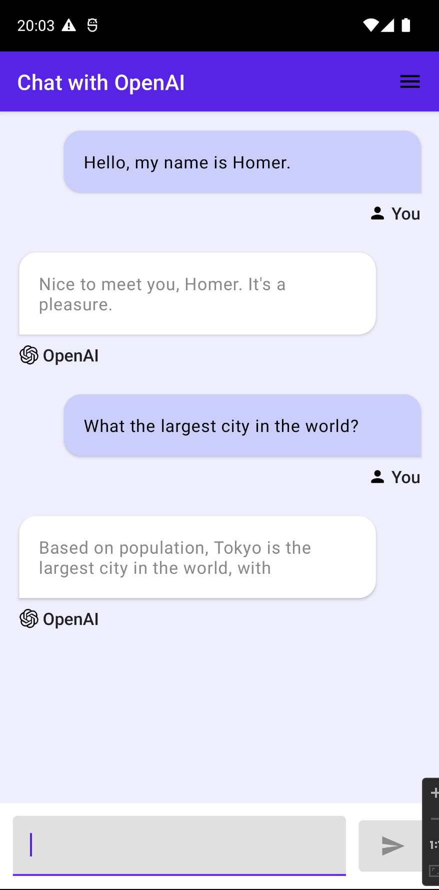
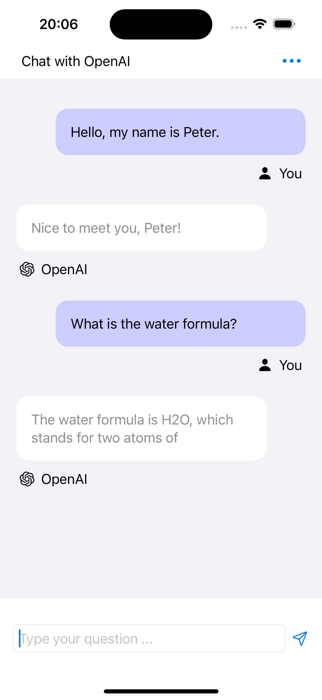

# Kotlin Multiplatform Mobile app using OpenAI

This is a example of using the OpenAI API in a Kotlin Multiplatform project.

### Architecture:
* KMM (Kotlin Multiplatform Mobile)
* MVI (Model View Intent)
* UI layer: Jetpack Compose (Android) and SwiftUI (iOS)

### References:
* OpenAI Kotlin client: https://github.com/aallam/openai-kotlin
* Project template: https://github.com/eduayuso/kmm-mvi-compose-swiftui

### Instructions
* Clone project
* Put your OpenAI API key in Koin.kt
* Run on Android or iOS from Android Studio (with KMM Plugin) or in iOS from XCode (open file /iosApp/iosApp.xcodeproj)

### TO DO:
* Settings view in iOS app
* Common theme
* Shared resources
* Scroll to bottom at receive new messages
* Persist messages
* Tests

### Screenshots

